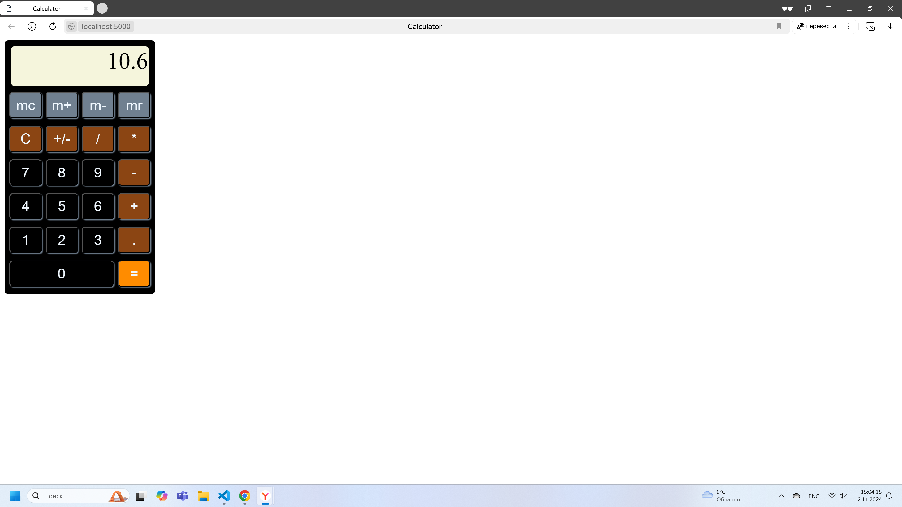
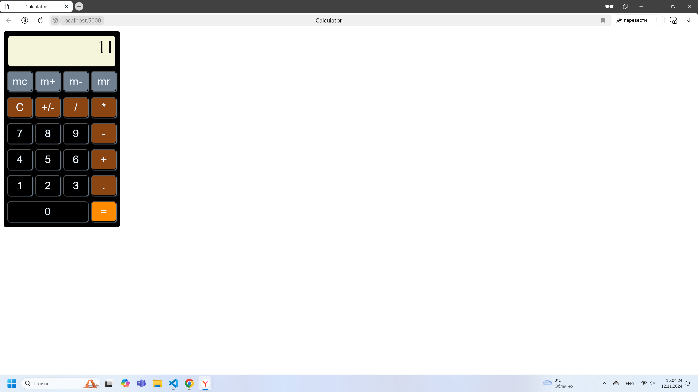

# 1. Описание проекта:

В данном проекте реализован калькулятор на чистом JavaScript со сборкой в webpack.  

Версия node.js 20.9.0

### Поддерживаемые операции:  

- сложение;  

- вычитание;  

- умножение;  

- деление;  

- сброс значения до нуля (кнопка С).  


### Поддерживаемые числа:  

- положительные;  

- отрицательные;  

- дробные (с запятой);  


Взаимодействие с калькулятором осуществляется с помощью мышки.  JS поддерживает модули.  

## 2. Запуск проекта:
2.1. Клонировать репозиторий

2.2. В клонированной директории выполнить команду:    

```
npm install
```

2.3. Для сборки приложения выполнить в клонированной директории команду:    

```
npm run build-dev
```  

2.4. Для запуска выполнить в клонированной директории команду:    

```
npm run start-dev
```  

2.5. Запуск тестов:  

```
npm run test
```  

## 3. Наполнение проекта:

3.1. `index.html` содержащий пустой контейнер для заполнения.

3.2. Файл `calculatorComponent.js` это экспортируемый класс, с методом создания элементов и событий калькулятора.   

3.3. Файл `calculator.js` отслеживает заполнение операндов и производит вычисления.  

3.4. Файл `main.js` создает экземпляр конструктора `calculatorComponent.js` и сохраняет в разметку.  

3.5. `outputWindow.js` отвечает за отображение введеных значений (окно вывода).  

3.6. `stypes.js` файл содержащий в себе все стили проекта, подключается в проект внутри webpack.  

## 4. Скриншоты приложения  





